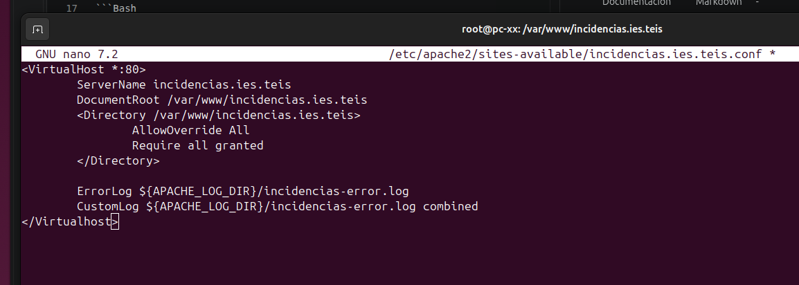
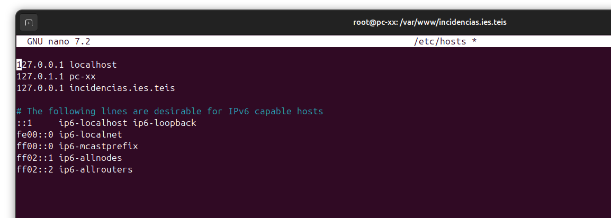

# Manual de Instalacion de la aplicacion web

## Decisiones de proyecto 

|Elemento|Decision|Version|Justificacion|
|--------|---------|-------|---------|
|Servidor Web|Apache|2|Sencillo de usar|
|Base de Datos| MySQL|8|Experiencia previa, popular|
|Lenguaje Servidor|Pyton|3|Muy interesante para ASIR, uso Extendido|
|Framework|Flash|3|Sencillo de usar, pensado expecificamente para web (Formularios,Sesiones)|
|Control de Versiones|Git|2|Muy Extendido|
|Documentacion|Markdown|-|Muy utilizado con Github|

## Proceso de instalacion / puesta en marha

1. Actualizar el sistema
```Bash
 sudo apt update 
 sudo apr upgrade
 ```
2. Instalar git
```Bash
sudo apt install git
 ```
1. Instalar VS Code + Plugins
   - Markdown all in one
   - Python
   
## Que hace un servidor web
Recibe solicitudes de un cliente y si lo encuentra se lo muestra, si no lo encuentra le dice al cliente que no lo tiene

## Cambiar permisos carpeta /var/www/html
``` BASH
sudo chown -R $USER:$USER /var/www/html
sudo chmod -R u=rwX,go=rX /var/www/html
```

## Nuestra pagina
``` Bash
mkdir -p /var/www/incidencias.ies.teis
sudo chown -R $USER:$USER /var/www/html
sudo chmod -R u=rwX,go=rX /var/www/html
```

## Foto 1
### Creamos este archivo con el siguiente texto


## Foto 2
### Editamos el archivo para añadir localmente el nombre que queremos que nos aparezca ya que nuestro navegador no tiene un dns que reconozca el nombre de la pagina.


#Instalar MYSQL server

``` Bash
Sudo apt isntall mysql-server
```

## Crear base de datos e usuario

``` mysql  
create database incidencias;
CREATE USER 'incidencias'@'localhost' IDENTIFIED BY 'incidencias';
system clear (Limpiar la pantalla)
show databases;
select user from mysql.user;


 create table registro( 
   id int auto_increment primary key, 
   aula varchar(30), 
   descripcion text, 
   usuario varchar(20),  
   estado varchar(30)
   );

INSERT INTO registro (aula, descripcion, usuario, estado)
VALUES
('Taller1', 'PC24 No arranca', 'usuario1', 'Pendiente'),
('Taller5', 'PC21 No arranca', 'usuario2', 'Pendiente');

```

## Configutacion de GIT/GITHUB
1. Crear repositorio local

``` Bash
Git init 
git add .
git commit -m "Comentario"

```
2. Crear cuenta github, crear repositorio en github
3. Conectar repositorio local con remoto

git remote add origin https://github.com/diegoalonsoocampo10/incidencias.ies.teis.git
git branch -M main
git push -u origin main

# Pasar el sitio que tienes en github a local (tiene que ser publico)
git clone https://github.com/diegoalonsoocampo10/Incidencias.ies.teis
O descargar el arcgivo ZIP desde github

# Cogerte los cambios quie tienees en GitHub y traertelo para local
git pull 

## Instalar Python y componentes relacionados

```bash
sudo apt install python3 python3-pip python3-vnev -y
```

### Crear entorno virtual / Puesta en marcha

```bash
python3 -m venv venv
source venv/bin/activate
``` 

## Instalalar flask, conector de bases de datos, comprobar que guarda las dependencias (en el entorno virtual "ejem ruta:(venv) root@pc-xx:/var/www/incidencias.ies.teis#")

```bash 
pip install flask
pip install mysql-connector-python
pip list
pip freeze > requirements.txt
```

## Crear fichero .gitignore desde visualstudio en la carpeta del proyecyo
### Escribir unos comandos dentro del fichero

venv/
_pycache__/
*.pyc
.env

## Nuestra primera aplicacion Python/Flask
 ### Crear fichero app.py
```Python
from flask import Flask

app = Flask (_name_)
@app.route("/")
def iniciao():
   return "<h1>Incidencias Ies Teis</h1>"

if _name_ == "_main_":
   app.run(debug=True)
```

## Ejecutamos 
python3 app.py

- Lo que hace esto es crear un servidor web arternativo en localhost en el puerto 5000 (http://incidencias.ies.teis:5000/)

# Migracion de formulario
1. Creamos carpeta templates y movemos nuestro index.html 
2. Modificamos app.py

``` Python
from flask import Flask, render_template

app = Flask (__name__)
@app.route("/")
def inicio():
   return render_template("index.html")
if __name__== "__main__":
   app.run(debug=True)

```
3. Comrpobamos entrando en (http://incidencias.ies.teis:5000/) que hemos conseguido que el formulario lo devuelva flash
   
## Recibir los datos de vuelta 
### Modificamos fichero app.py 
```python
from flask import Flask, render_template,request

app = Flask (__name__)
@app.route("/")
def inicio():
   return render_template("index.html")

@app.route("/incidencia", methods=["POST"])
def crear_incidencia():
    # Lógica para crear la incidencia
    aula = request.form["aula"]
    usuario = request.form["usuario"]
    descripcion = request.form["descripcion"]

    print("Aula:", aula)
    print("Usuario:", usuario)
    print("Descripción:", descripcion)

    return "Incidencia recibida"


if __name__== "__main__":
   app.run(debug=True)
```

- Ahora al entrar en la url y poner los datos nos pone (Incidencia Recibida)

## Rutina de trabajo 

```bash
cd /var/www/incidencias.ies.teis
source venv/bin/activaate
python app.py # Lanzar app
```
- Al terminar
  
```bash
#ctrl+c para app
deactivate #salir del entorno
```
## Ejemplo clase
{    return " <h1>Incidencia recibida</h1> " \
    "<ul> " \
      " <li>Aula: " + aula +" </li> " \
      " <li>Usuario: " + usuario +" </li> " \
      " <li>Descripción: " + descripcion +" </li> " \
    "</ul> " }

   ## Modificamos archivo app para anadir base de datos 

```python
from flask import Flask, render_template,request
import mysql.connector

app = Flask (__name__)


@app.route("/")
def inicio():
   return render_template("index.html")

@app.route("/incidencia", methods=["POST"])
def crear_incidencia():
   # Lógica para crear la incidencia
   aula = request.form["aula"]
   usuario = request.form["usuario"]
   descripcion = request.form["descripcion"]

   print("Aula:", aula)
   print("Usuario:", usuario)
   print("Descripción:", descripcion)

   app.config['MYSQL_HOST'] = 'localhost'
   app.config['MYSQL_USER'] = 'incidencias'
   app.config['MYSQL_PASSWORD'] = 'incidencias'
   app.config['MYSQL_DB'] = 'incidencias'

   conexion = mysql.connector.connect(
      host=app.config['MYSQL_HOST'],
      user=app.config['MYSQL_USER'],
      password=app.config['MYSQL_PASSWORD'],
      database=app.config['MYSQL_DB']
   )
   cursor = conexion.cursor()

   sql = """Insert into registro (aula, usuario, descripcion, estado) values (%s, %s, %s, %s)"""
   valores= (aula, descripcion, usuario, "Abierta")
   cursor.execute(sql, valores)
   conexion.commit()
   cursor.close()
   conexion.close()

   return "Incidencia recibida"


if __name__== "__main__":
   app.run(debug=True)
   ```
